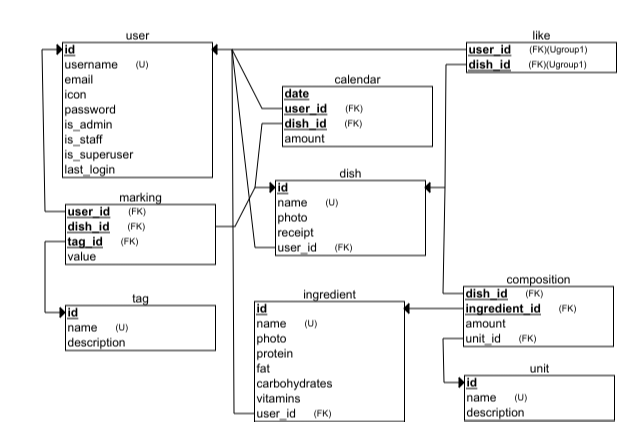

## Menu.

MVP.
To collect dishes which you like.  
To find fast what to cook from existing
ingredients.  
To feed yourself healthy dishes.  
To share dishes
receipts.

## Install on a server.

1.  > gh repo clone andreydmitr20/menu

2.  Create .env file inside /env folder.
    It should contain something like that:
    SECRET_KEY = "yfYAF5eGCekxO8eobSN0ChAdscF5ygbntIa6ud0JVTQ6JgSsmN"
    DEBUG=True

3.  Copy /utils/test_db.sqlite3 into /db/db.sqlite3

4.  Run

    > docker compose build

5.  Run

    > docker compose up

6.  f you need do make some operations on database, use:
    > docker ps -a
    > to find the docker-menu container id.

Then run:

> docker exec -it <docker-menu container id> /in/sh

After that you can run commans inside container like this:

\# python3 manage.py migrate

## Debug on a local computer.

1. Make .venv

   > python3 -m venv .venv

2. > source .venv/bin/activate

3. > pip3 install -r requirements.txt

4. Change appropriate api URL in /www/js/common.js:
   // const API_URL = "http://memenu.me:8000/";
   const API_URL = "http://127.0.0.1:8000/";

5. > python3 manage.py runserver

6. Then open in your browser (put your path instead of "....."):
   file:///...../menu/www/html/index.html

## Relational schema

## Icons:

<a href="https://www.flaticon.com/free-icons/menu" title="menu icons">Menu icons created by Becris - Flaticon</a>
<a href="https://www.flaticon.com/free-icons/settings" title="settings icons">Settings icons created by Freepik - Flaticon</a>
<a href="https://www.flaticon.com/free-icons/settings" title="settings icons">Settings icons created by Freepik - Flaticon</a>
<a href="https://www.flaticon.com/free-icons/ingredient" title="ingredient icons">Ingredient icons created by SetitikPixelStudio - Flaticon</a>
<a href="https://www.flaticon.com/free-icons/salad" title="salad icons">Salad icons created by Mihimihi - Flaticon</a>
<a href="https://www.flaticon.com/free-icons/eye" title="eye icons">Eye icons created by Kiranshastry - Flaticon</a>
<a href="https://www.flaticon.com/free-icons/food-and-restaurant" title="food and restaurant icons">Food and restaurant icons created by Icon home - Flaticon</a>
<a href="https://www.flaticon.com/free-icons/cancel" title="cancel icons">Cancel icons created by Alfredo Hernandez - Flaticon</a>
<a href="https://www.flaticon.com/free-icons/spoon" title="spoon icons">Spoon icons created by Triangle Squad - Flaticon</a>
<a href="https://www.flaticon.com/free-icons/brands" title="brands icons">Brands icons created by Freepik - Flaticon</a>
<a href="https://www.flaticon.com/free-icons/more" title="more icons">More icons created by Anggara - Flaticon</a>
<a href="https://www.flaticon.com/free-icons/search" title="search icons">Search icons created by Maxim Basinski Premium - Flaticon</a>
<a href="https://www.flaticon.com/free-icons/plus" title="plus icons">Plus icons created by Vectors Market - Flaticon</a>
<a href="https://www.flaticon.com/free-icons/vitamins" title="vitamins icons">Vitamins icons created by Freepik - Flaticon</a>
<a href="https://www.flaticon.com/free-icons/tick" title="tick icons">Tick icons created by Octopocto - Flaticon</a>
